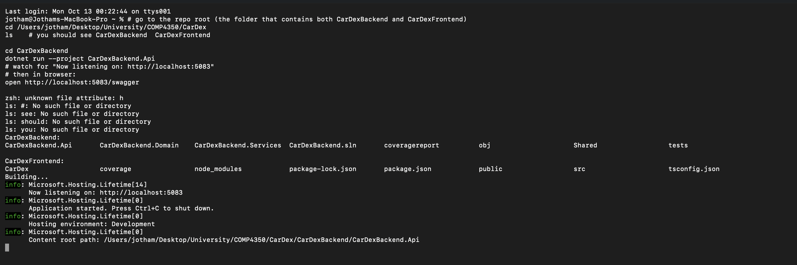
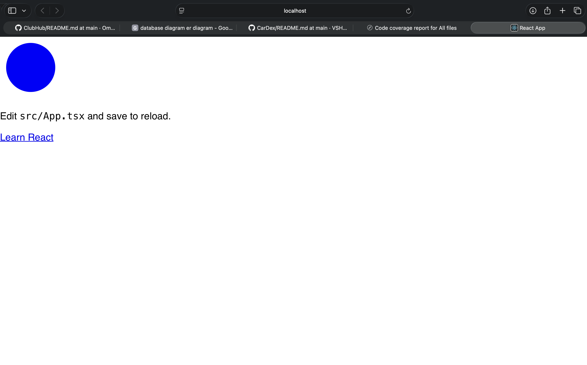
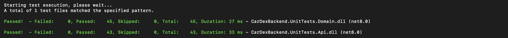
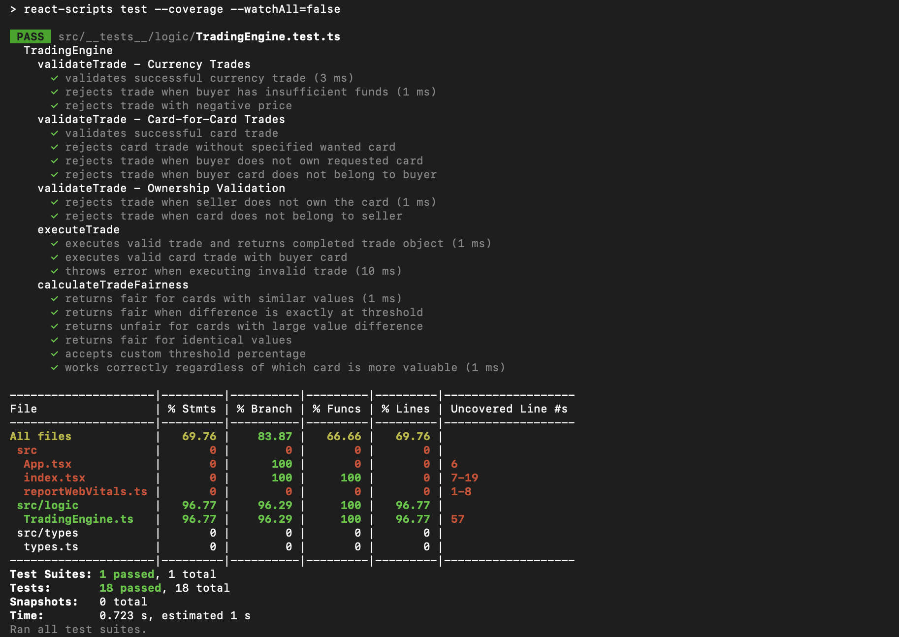
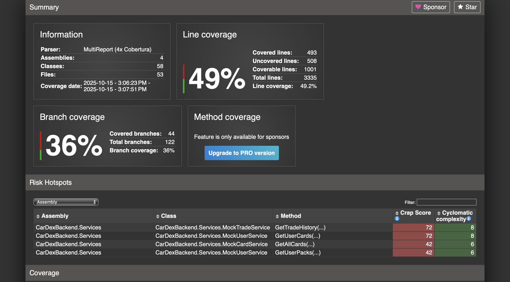
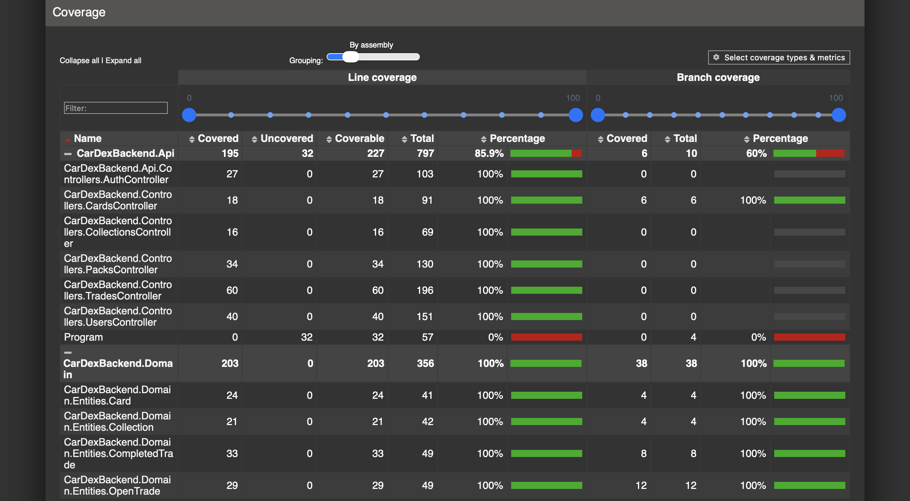
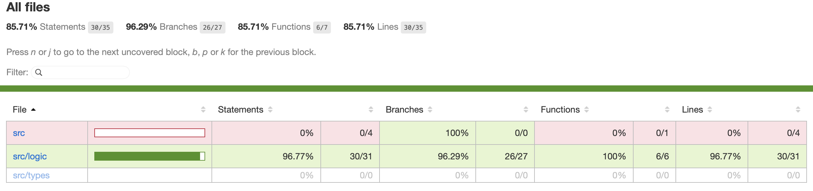

# Reproducible Environments Report

## Clarity of Documentation
- The README provided sufficient steps to build and run both the backend and frontend.  
- A minor issue occurred with copy-pasted commands (`ls: no such file or directory` errors due to `#` comments being interpreted as arguments). This could be avoided with clearer formatting in the setup guide.  
- Overall, instructions were straightforward once corrected.  

**Backend Running Screenshot:**  

---

## Successful Setup
- Backend started successfully on `http://localhost:5083/swagger`.  
- Frontend compiled and launched correctly, showing the default React page.  

**Frontend Running Screenshot:**  

---

## Test Results
- Unit tests executed without failures:  
  - **Domain Tests:** 45/45 passed.  
  - **API Tests:** 43/43 passed.  
  - **Frontend Tests (Jest):** All passed with ~97% coverage for core logic.  

**Backend Unit Tests:**  

**Frontend Test Execution:**  

---

## Coverage Results
- **Backend coverage:** ~49% line coverage, 36% branch coverage overall, with some hotspots in `MockTradeService` and `MockUserService`.  
- **Frontend coverage:** 85–96% for logic files, but 0% in some boilerplate files (`src` root, types).  

**Backend Coverage Summary:**  

**Backend Coverage Detail:**  

**Frontend Coverage Report:**  

---

## Time to Run
- Backend setup and execution: ~15 minutes (including fixing command-line issues).  
- Frontend setup and run: ~10 minutes.  
- **Total time:** ~25 minutes to get both systems running and tests passing.  

---

## Issues Faced
- Copy-paste issues with shell commands in documentation led to initial confusion.  
- Some tests indicated gaps in coverage, with higher cyclomatic complexity in certain backend service methods, suggesting potential maintainability concerns.  
- Distributed system aspects (backend + frontend coordination) ran smoothly since both components launched locally, but scaling and environment consistency might be more complex without Docker or containerization instructions.  

---

 **Summary:** The environment was reproducible within ~25 minutes. Tests passed successfully, though documentation could be slightly clearer. Coverage metrics highlight areas for improvement in backend test depth.  

Note: This report was created with the assisance of chatGPT.
