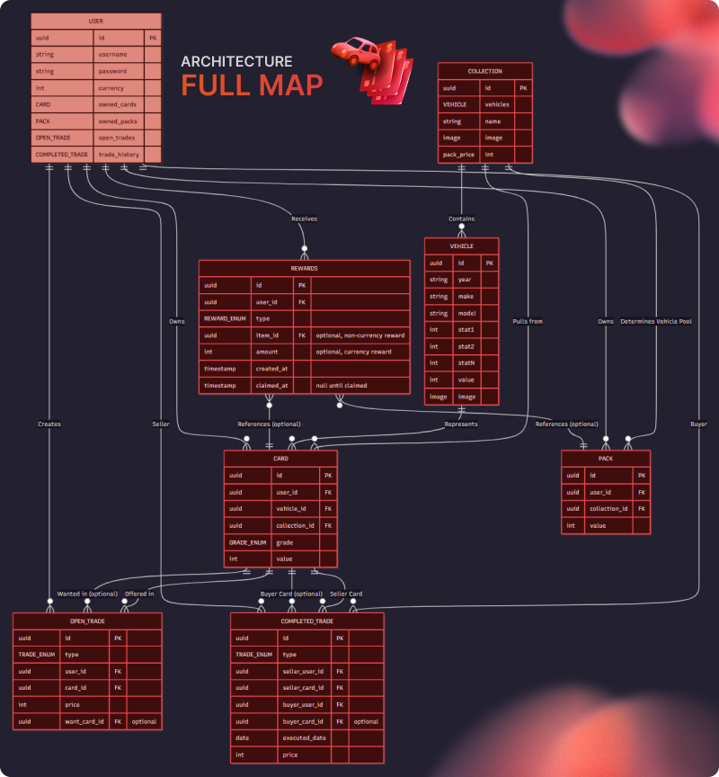
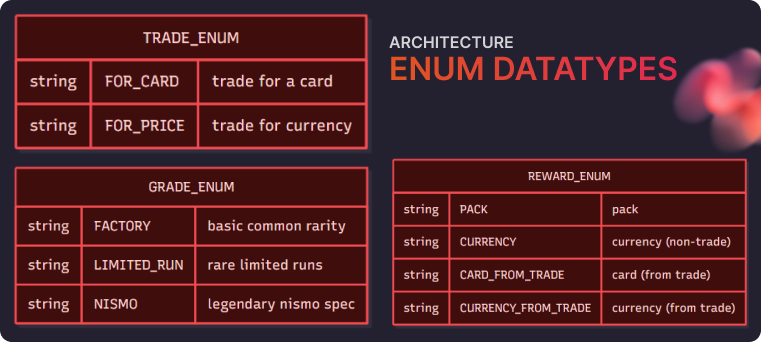

  

# Overview

Below is the full map of CarDex's architecture, including the Data Objects, ENUM types, and their relationships.
We chose to use an ID-based system (UUIDs) to connect tables, layers, and (eventually) logic together.

> **NOTE**
> ChatGPT was used to assist in drafting, but the actual architecture diagrams and data flow are original.

---

## Core Data Objects

  

### USER

*Users that will use the application*

**Attributes:**

| Name          | Type             | Description                                  |
| ------------- | ---------------- | -------------------------------------------- |
| id            | uuid (PK)        | Unique identifier for the user               |
| username      | string           | User's display name                          |
| password      | string           | Authentication credential (should be hashed) |
| currency      | int              | In-game currency balance                     |
| owned_cards   | reference (list) | Cards owned by the user                      |
| owned_packs   | reference (list) | Unopened packs owned by the user             |
| open_trades   | reference (list) | Active trade listings created by the user    |
| trade_history | reference (list) | Completed trades history                     |

**Relationships:**

* 1:N with **CARD**
* 1:N with **PACK**
* 1:N with **OPEN_TRADE**
* 1:N with **COMPLETED_TRADE** (as buyer and seller)
* 1:N with **REWARDS**

---

### VEHICLE

*Master vehicle metadata. Basis for cards and packs. Includes stats and other model information*

**Attributes:**

| Name  | Type      | Description                              |
| ----- | --------- | ---------------------------------------- |
| id    | uuid (PK) | Unique identifier for the vehicle        |
| year  | string    | Manufacturing year                       |
| make  | string    | Manufacturer (e.g., Nissan, Toyota)      |
| model | string    | Model name                               |
| stat1 | int       | Performance statistic (e.g., horsepower) |
| stat2 | int       | Performance statistic (e.g., speed)      |
| statN | int       | Other stats (e.g., handling)             |
| value | int       | Base vehicle value                       |
| image | image     | Vehicle artwork/image                    |

**Relationships:**

* 1:N with **CARD** (a vehicle can generate many card instances)
* N:M with **COLLECTION** (vehicles belong to collections)

---

### CARD

*An owned card instance, tied to a specific VEHICLE.*

**Attributes:**

| Name          | Type       | Description                |
| ------------- | ---------- | -------------------------- |
| id            | uuid (PK)  | Unique card instance ID    |
| user_id       | uuid (FK)  | Current owner              |
| vehicle_id    | uuid (FK)  | Vehicle metadata reference |
| collection_id | uuid (FK)  | Collection origin          |
| grade         | GRADE_ENUM | Card rarity/grade          |
| value         | int        | Card’s trade value         |

**Relationships:**

* N:1 with **USER**
* N:1 with **VEHICLE**
* N:1 with **COLLECTION**
* 1:N with **OPEN_TRADE**
* 1:N with **COMPLETED_TRADE**

---

### PACK

*Unopened randomized pool of cards from a collection.*

**Attributes:**

| Name          | Type      | Description             |
| ------------- | --------- | ----------------------- |
| id            | uuid (PK) | Unique pack instance ID |
| user_id       | uuid (FK) | Current owner           |
| collection_id | uuid (FK) | Determines vehicle pool |
| value         | int       | Pack’s price/value      |

**Relationships:**

* N:1 with **USER**
* N:1 with **COLLECTION**
* 1:N with **REWARDS**

**Lifecycle:**

1. Purchased with currency
2. Added to user inventory
3. When opened → deleted and generates new CARD instances

---

### COLLECTION

*Themed set of vehicles defining pack contents.*

**Attributes:**

| Name       | Type      | Description                              |
| ---------- | --------- | ---------------------------------------- |
| id         | uuid (PK) | Collection ID                            |
| vehicles   | reference | Vehicles inside this collection          |
| name       | string    | Collection name                          |
| image      | image     | Collection banner/image                  |
| pack_price | int       | Price to buy a pack from this collection |

**Relationships:**

* 1:N with **VEHICLE**
* 1:N with **PACK**
* 1:N with **CARD**

---

## Trading System

### OPEN_TRADE

*Active trade listing.*

**Attributes:**

| Name         | Type                | Description                     |
| ------------ | ------------------- | ------------------------------- |
| id           | uuid (PK)           | Trade listing ID                |
| type         | TRADE_ENUM          | FOR_CARD / FOR_PRICE            |
| user_id      | uuid (FK)           | Seller                          |
| card_id      | uuid (FK)           | Offered card                    |
| price        | int                 | Currency price (FOR_PRICE)      |
| want_card_id | uuid (FK, optional) | Specific card wanted (FOR_CARD) |

**Relationships:**

* N:1 with **USER**
* N:1 with **CARD**

---

### COMPLETED_TRADE

*Historical record of executed trades.*

**Attributes:**

| Name           | Type                | Description             |
| -------------- | ------------------- | ----------------------- |
| id             | uuid (PK)           | Completed trade ID      |
| type           | TRADE_ENUM          | FOR_CARD / FOR_PRICE    |
| seller_user_id | uuid (FK)           | Seller user             |
| seller_card_id | uuid (FK)           | Seller’s card           |
| buyer_user_id  | uuid (FK)           | Buyer user              |
| buyer_card_id  | uuid (FK, optional) | Buyer’s card (FOR_CARD) |
| executed_date  | date                | Trade completion date   |
| price          | int                 | Trade currency          |

**Relationships:**

* N:1 with **USER** (buyer & seller)
* N:1 with **CARD** (seller & optionally buyer)

---

## Rewards System

### REWARDS

*Tracks claimable items/currency.*

**Attributes:**

| Name       | Type                 | Description            |
| ---------- | -------------------- | ---------------------- |
| id         | uuid (PK)            | Reward ID              |
| user_id    | uuid (FK)            | Rewarded user          |
| type       | REWARD_ENUM          | Reward type            |
| item_id    | uuid (FK, optional)  | Pack or Card reference |
| amount     | int (optional)       | Currency amount        |
| created_at | timestamp            | Earned at              |
| claimed_at | timestamp (nullable) | Claimed at             |

**Reward Types (REWARD_ENUM):**

* PACK → New pack
* CURRENCY → Currency (non-trade)
* CARD_FROM_TRADE → Card from trade
* CURRENCY_FROM_TRADE → Currency from trade

---

## ENUM Data Types

  

### TRADE_ENUM

| Value         | Meaning                |
| ------------- | ---------------------- |
| **FOR_CARD**  | Trade for another card |
| **FOR_PRICE** | Trade for currency     |

### GRADE_ENUM

| Value           | Meaning               |
| --------------- | --------------------- |
| **FACTORY**     | Basic/common rarity   |
| **LIMITED_RUN** | Rare, limited edition |
| **NISMO**       | Legendary rarity      |

### REWARD_ENUM

| Value                   | Meaning                               |
| ----------------------- | ------------------------------------- |
| **PACK**                | Pack reward                           |
| **CURRENCY**            | Currency (non-trade) reward           |
| **CARD_FROM_TRADE**     | Card earned from trade completion     |
| **CURRENCY_FROM_TRADE** | Currency earned from trade completion |

---

## Key Workflows

### Purchasing a Pack

1. Verify user has enough currency
2. Deduct COLLECTION.pack_price
3. Create PACK with user_id & collection_id
4. Add to user inventory

### Opening a Pack

1. Retrieve vehicles from COLLECTION
2. Generate random cards w/ grades
3. Create CARD instances
4. Delete PACK

### Completing Trades

* **FOR_PRICE:** Currency exchanged, card ownership transferred
* **FOR_CARD:** Card-for-card swap
* In both: OPEN_TRADE deleted, COMPLETED_TRADE + REWARDS created

---

## Design Notes

* **Scalability:** UUIDs for distributed use, separate active vs completed trades.
* **Integrity:** Atomic ownership, transactional trades, currency never negative.
* **Security:** Hash passwords, validate transactions, rate-limit actions.
* **Future Enhancements:** Auctions, limited supply vehicles, reward expiration, daily login bonuses.

---

# Summary

CarDex supports:

* Pack purchasing/opening
* Card rarity system
* Currency & card-for-card trades
* Trade history tracking
* Unified rewards inbox
* ENUMs for consistent trade, reward, and grade typing
* Scalable collection-based content
