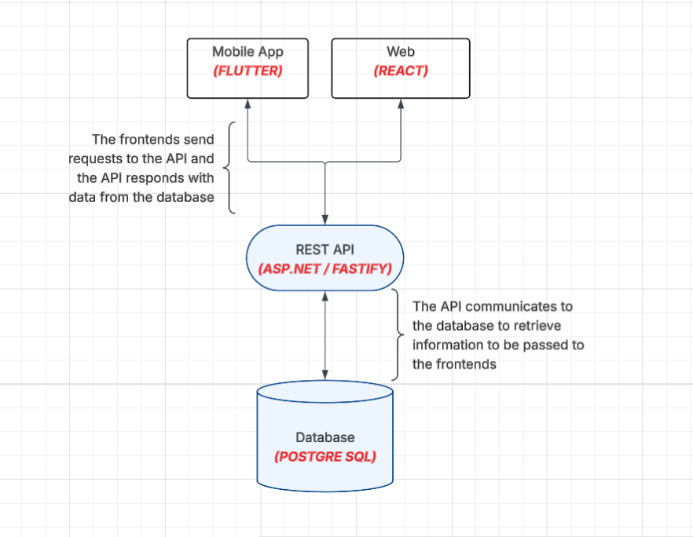

# Project Proposal – Car Trading Card Game

# Table of Contents

1. [Project Summary](#project-summary)
2. [Features](#features)
   - [Core Features](#core-features)
   - ["Nice-to-Have" Features](#nice-to-have-features)
3. [User Stories](#user-stories)
4. [Initial Architecture](#initial-architecture)
   - [High-Level Architecture Diagram](#high-level-architecture-diagram)
   - [Planned Technologies](#planned-technologies)
   - [Architecture Rationale](#architecture-rationale)
5. [Work Division & Coordination](#work-division--coordination)

# Project Summary
Our project is a digital **Trading Car Card Game** where players collect, trade, and race cars represented as digital cards. Each car card has unique performance stats and rarity levels, making collection and strategy central to gameplay.  

The goal is to deliver both the excitement of opening randomized packs and the long-term engagement of completing collections, trading with friends, and racing cars competitively. By blending aspects of collectible card games with racing mechanics, our app provides a unique experience for both car enthusiasts and fans of card-based games.

You can also view the PDF copy of our presentation slides for this proposal here: [Cardex-Proposal-Slides.pdf](docs/Cardex-Proposal-Slides.pdf), or found in `/docs/Cardex-Proposal-Slides.pdf`

---

# Features

## Core Features

These are the features for our Minimum Viable Product (MVP) that are essential to exist at launch.

1. **Pack Opening** – Players open randomized packs to unlock cars of varying rarities.  
2. **Trading** – Secure peer-to-peer trading of car cards between players.  
3. **Collections** – Completing themed sets grants rewards like bonus packs or exclusive cars.  
4. **Racing** – Cars can race against other players or AI based on stats.  
5. **Scalability** – The system should be able to handle at least **100 concurrent users** performing core actions (pack opening, trading, racing) without degradation.

## "Nice-to-Have" Features

These are the features that are not necessary right away, but will be nice to have for user-experience.

6. **Upgrades** – Players upgrade performance stats or personalize cars with skins and decals.  
7. **Socials** – Players can showcase collections, rare pulls, and wins on leaderboards or in a community hub.

---

## User Stories

    # NEED USER STORIES FOR ALL 5 LISTED CORE FEATURES. Should probably just create github issues and link them here.
    Write user stories in the standard format:

        As a [role], I want [goal] so that [benefit].

    Include acceptance criteria for each core feature. Use the RubyGarage acceptance criteria guide as a template.

- **As a player**, I want to open packs so that I can collect rare and exciting cars.  
- **As a trader**, I want to swap cars with other players so that I can complete my favorite collections.  
- **As a competitor**, I want to race my cars against others so that I can test my collection’s strength.  

---

# Initial Architecture

## High-Level Architecture Diagram

## Planned Technologies

Frontend (Mobile): **Flutter**

Frontend (Web): **React**

Backend API: **ASP.NET Core** (or Fastify/Node.js as fallback)

Database: **PostgreSQL + Prisma**

Deployment/DevOps: **Docker**

### Architecture Rationale

This architecture works well because it separates concerns cleanly between mobile, web, backend, and database tiers.  

- **Flutter (Mobile):** One codebase for iOS and Android with near-native speed, ideal for swipe, flip, and trading animations that make the mobile garage feel interactive and alive.  
- **React (Web):** Great for building rich, responsive websites; it lets us show high-resolution car cards and makes comparing collections on desktop smooth and fast.  
- **ASP.NET Core / Fastify (Backend API):** Provides a secure, high-performance backend that keeps trades instant, updates collections in real time, and scales as more collectors join.  
- **Swagger / OpenAPI:** Enables live, interactive API documentation so web and mobile teams can test trading and racing features without guesswork.  
- **PostgreSQL + Prisma (Database):** A rock-solid database to store every car card, user garage, and trade history safely, while Prisma simplifies database interactions and schema evolution.  
- **Docker:** Ensures consistent development environments and simplifies local testing and future deployment.  

# Work Division & Coordination
    
With 6 team members, we will divide work across three main areas:

Frontend (Flutter & React): 2 members will focus on mobile and web UI/UX.

Backend (API & Logic): 2 members will implement API endpoints, authentication, and racing/trading logic.

Database & DevOps: 2 members will design schemas, manage migrations with Prisma, and handle Docker setup/deployment.

We will coordinate work using weekly meetings, short sprint cycles, and GitHub pull requests with code reviews. Communication will be managed through a team chat (e.g., Discord/Slack) and task tracking in GitHub Projects or Jira.